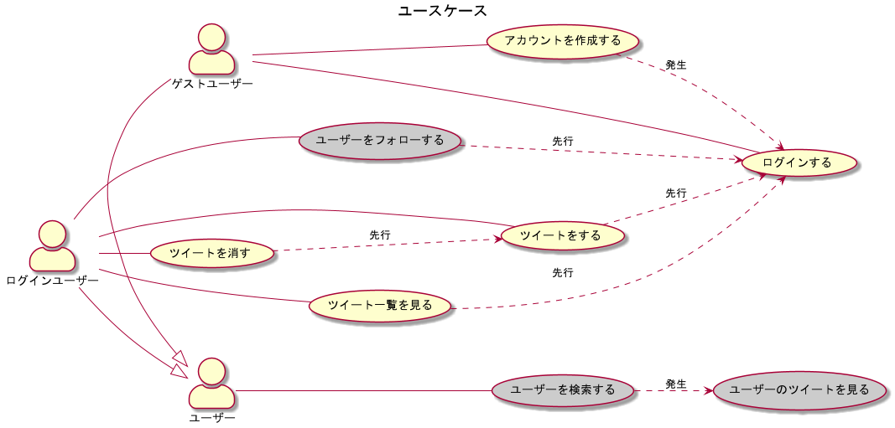
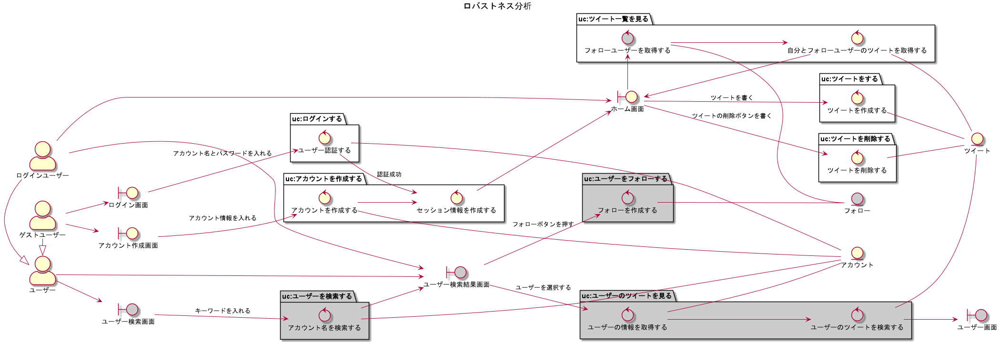
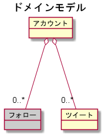

# はじめに

本書ではRustを使ってウェブアプリケーションを開発する方法を学びます。

## 本書の見方

本書は

- [Django](https://developer.mozilla.org/ja/docs/Learn/Server-side/Django) や [Express](https://developer.mozilla.org/ja/docs/Learn/Server-side/Express_Nodejs) などのフレームワークを使い、チュートリアルに沿ってウェブアプリ開発を試したことがある
- [Rust By Example](https://doc.rust-jp.rs/rust-by-example-ja/index.html) の内容がだいたい分かる

というレベル感の方を対象に、rustでのウェブアプリの開発が理解できるようになることを狙いとしています。

各ページごとに、サンプルアプリの実装を進めながら実装のポイントをおさえていきます。

## 学習に利用するサンプルアプリ

サンプルアプリとして Twitter クローンを実装してみます。

下記に各種設計資料を示しますが、今回はグレーになっていない部分を実装します。

#### URL設計

各画面のURLをどうするか検討しておく必要があります。

|メソッド&パス|画面|処理内容|処理後の表示内容|ログイン|
|:--|:--|:--|:--|:--|
|GET /|ホーム画面|ツイート一覧を取得する|-|必須|
|POST /tweets/new|-|投稿フォームの内容に従ってツイートを作成する|ホーム画面|必須|
|POST /tweets/:id/delete|-|指定されたIDのツイートを削除する|ホーム画面|必須|
|GET /login|ログイン画面|-|-|-|
|POST /account/session|-|メールアドレスとパスワードでログイン認証する|ホーム画面 or ログイン画面|-|
|GET /register|アカウント作成画面|-|-|
|POST /account/new|-|フォームの内容でアカウントを作成する|ホーム画面|-|

#### ユースケース

ユーザーの要求とシステムの振る舞いを視覚的に明確化したものがユースケース図です。

#### ロバストネス分析

ユースケースを、よりシステムの観点で記載したものがロバストネス分析図です。

#### ドメインモデル

ビジネスモデルをデータの観点で洗い出したものがドメインモデル図です。

今回はそこまで複雑な機能は作り込まずシンプルなモデリングにしているため、登場するドメインモデルは少なめになっています。

